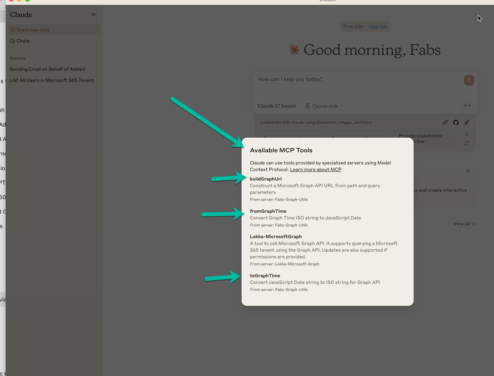
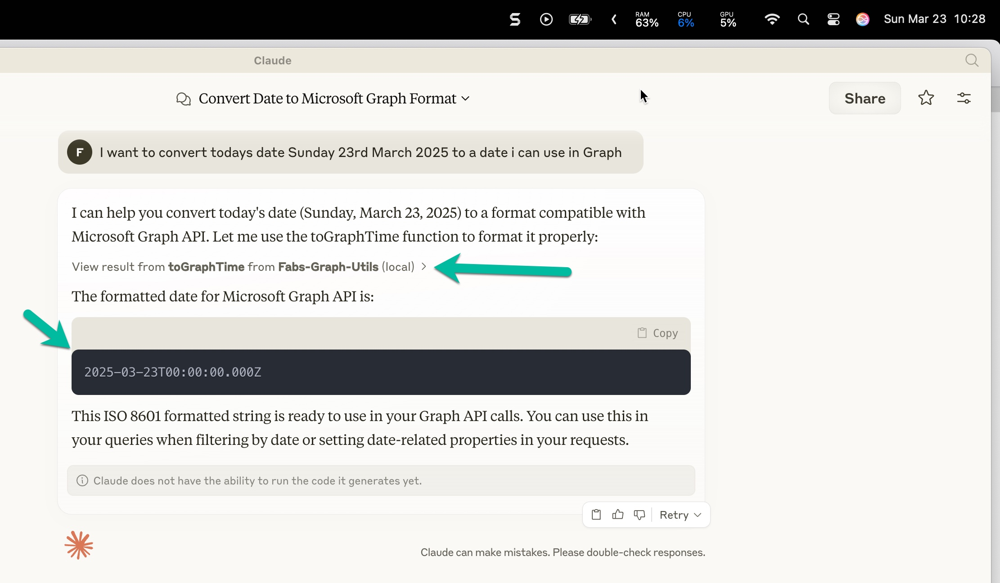
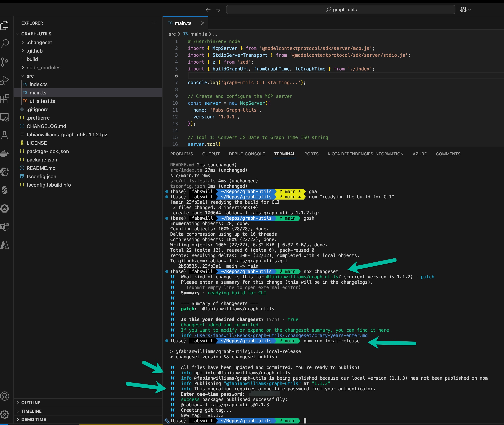
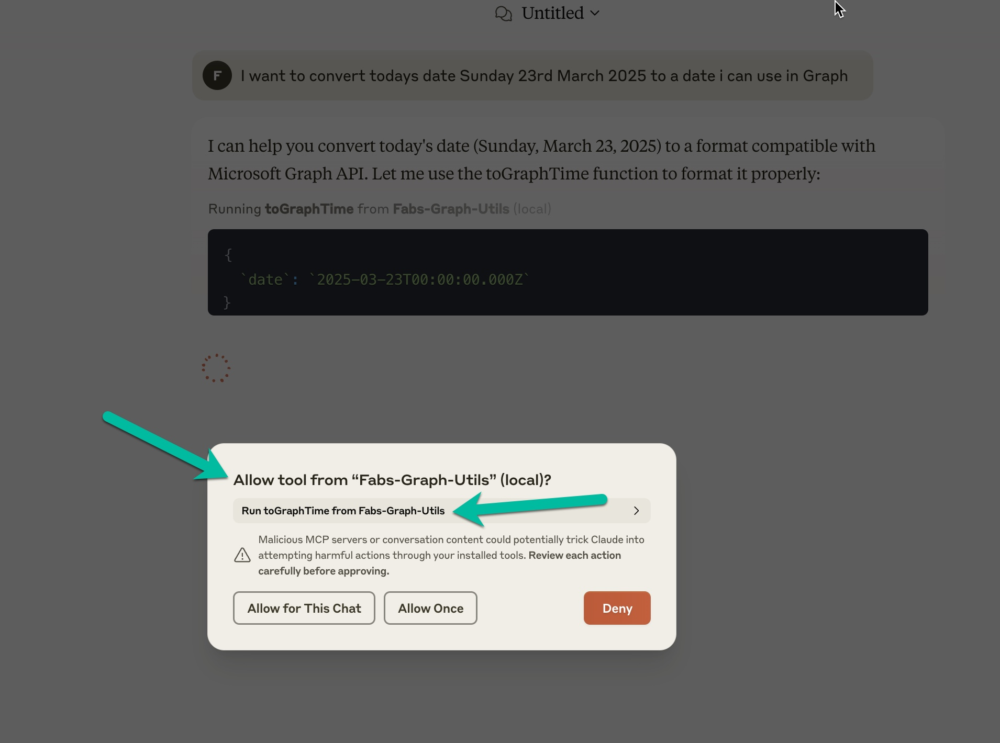

# 🔍 Search Microsoft 365 Files with Model Context Protocol (MCP) + Microsoft Graph

Ever wanted to ask an AI assistant like Claude or ChatGPT to search your OneDrive or Microsoft 365 files — _and actually get a real, accurate result_? This project shows you exactly how to do that using **Model Context Protocol (MCP)**, **Microsoft Graph**, and a set of handy utilities and plugins you can run locally or publish to npm.

> 🧠 **No deep coding knowledge required** — we break it down step by step.

---

## 📺 Overview

This repo is a companion to [this 5-minute YouTube video](https://go.fabswill.com/mcp-graphsearch) that walks through how MCP tools work with Microsoft Graph to search files and manipulate date formats.

➡️ **Watch it first for context!**



---

## 🧰 What’s Inside?

This project includes:

- ✅ MCP tools to query Microsoft Graph securely using app-only auth
- ✅ Utilities to convert dates to Graph-compatible formats
- ✅ A working example of how to run these tools inside Claude
- ✅ Full transcript and usage examples

---

## 💡 Use Case: Convert a Date to Microsoft Graph Format

Need to filter files in Graph by date? This tool converts a human-friendly date into the ISO 8601 string Microsoft Graph expects.

### Prompt inside Claude:

> I want to convert today’s date Sunday 23rd March 2025 to a date I can use in Graph

Claude uses the **`toGraphTime`** tool from your local MCP server:



Result:

```json
2025-03-23T00:00:00.000Z
```

🧠 This string is now ready to use in your Microsoft Graph API calls!

---

## 🛠 How This Works

This tool is powered by an MCP server you control. Here’s how it’s built and connected:

### Local Server Setup (Node.js MCP)

```ts
const server = new McpServer({
  name: 'Fabs-Graph-Utils',
  version: '1.0.1',
});

server.tool(buildGraphUrl, fromGraphTime, toGraphTime);
```

> 📸 Screenshot: Your code and publish process using `changesets`



---

## 🚦 Approving Tools in Claude

When Claude detects your MCP tool, it prompts you to allow it:



> 🔐 Tools are sandboxed — you control what’s exposed and run.

---

## 🧰 Tools Included

| Tool Name              | Description                                             |
| ---------------------- | ------------------------------------------------------- |
| `buildGraphUrl`        | Constructs a Microsoft Graph API URL from parts         |
| `fromGraphTime`        | Converts Graph ISO date → JavaScript Date               |
| `toGraphTime`          | Converts JavaScript Date → Graph ISO format             |
| `lokka-MicrosoftGraph` | Full-featured Graph search plugin (inspired by @merill) |

---

## 🧪 Try It Yourself

1. Clone the repo
2. Run `npm install`
3. Use `npm run start` to start the MCP server
4. Inside Claude (or any assistant supporting MCP), connect to your local tool
5. Ask questions like:
   - “List all Word documents I have access to”
   - “Convert today’s date to Graph format”
   - “What files has AdeleV created recently?”

---

## 🧠 Inspired By

- 🔗 [@merill’s Lokka Project on LinkedIn](https://www.linkedin.com/posts/merill_folks-today-im-launching-my-weekend-project-activity-7308508755099295744-hjoc)
- 🛠 This project builds on his open-source work and adds extra utility tooling

---

## 📦 NPM Package

- [`@fabianwilliams/graph-search-mcp`](https://www.npmjs.com/package/@fabianwilliams/graph-search-mcp)

---

## 🧠 Bonus: Learn More

- 🧑‍🏫 What is MCP? [ModelContextProtocol.dev](https://modelcontextprotocol.dev)
- 📚 Microsoft Graph API: [docs.microsoft.com](https://learn.microsoft.com/en-us/graph/overview)

---

## 📸 Image Credits

All screenshots are captured from:

- Fabian's Claude web app
- Fabian's Local development terminal
- Fabian's Visual Studio Code

## 💬 Feedback?

Open an issue here in Github or hit me up in the comments of the [YouTube video](https://go.fabswill.com/mcp-graphsearch)!

---

Made with 💡 + MCP by [@fabianwilliams](https://github.com/fabianwilliams)
